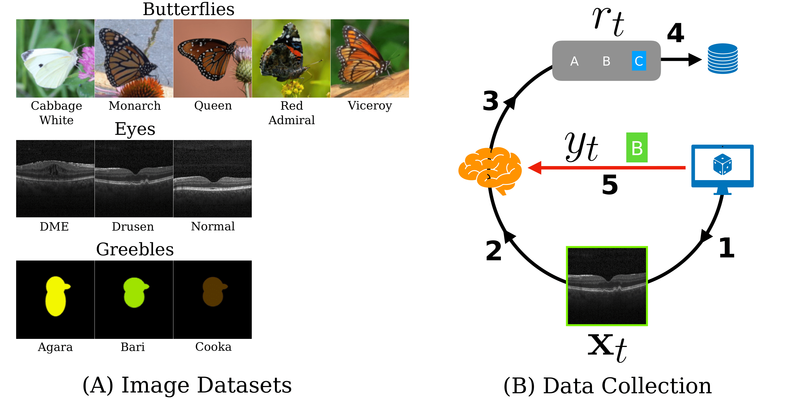

# Visual Knowledge Tracing
This is repository to recreate experiments 
in the paper Visual Knowledge Tracing (ECCV 2022)

### Table of Contents
1. [Introduction](#intro)
2. [Environment Setup](#env)
3. [Experiments](#experiments)

## Introduction

This document will guide you through setting up the project directory
in order to run the experiments presented in the paper and to develop new models
to try on this dataset.

### [[Dataset]](https://data.caltech.edu/records/20234)

The dataset contains three folders: `OCT/`, `greebles/`, `butterflies/`. 
Within each folder, there is a folder of `images/`, `mongodb_data/`, and a `<dataset-name>.json` file. 

The `mongodb_data/` folder contains the raw responses from subjects.   
The `<dataset-name>.json` contains the mapping between images and image_ids in the 
human data.

### [[Paper]](https://arxiv.org/abs/2207.10157v2) 
The experiments from the paper are contained within 
`/VisualKnowledgeTracing/experiments/vkt_experiment/`  
##### Main paper models - `experiment1.py`  
##### Supplemental models - `experiment<[2, 3, 4]>.py`

## Environment Setup

Setting up the environment to run these experiments. 

### Conda
A conda environment can be created using the environment.yml file.

Create : `conda env create -f <path_to_yaml_file>`  
Activate : `conda active VKT_env`  

### config.py
1. Download the dataset.

The paths to the dataset and output folders are set in the config.py file.    

2. Set the dataset path to the location of the dataset on your filesystem.  
3. Set the output path to the location where you'd like trained models to be stored. 

### subshell
This codebase was originally developed in Pycharm. Pycharm 
appends the project directory to the `sys.path` variable in python. 
Not appending this value will cause import issues.

If running scripts from terminal (as opposed to in an IDE), 
running this subshell _**from the main project directory**_ will address the import issue.

1) `cd /<ROOT>/VisualKnowledgeTracing/`
2) `./project_subshell`
3) `cd <folder of script>`
4) `python3 <script_name>.py`

You can skip the first step if you hard-code the root directory into 
the subshell script, then you will be able to 
activate the subshell from anywhere

`ctrl D` or `exit` will exit the subshell. 

## Experiments

####  Preparing the data
1. Run all of the scripts `prep_<dataset>_data.py`.   
They will process, format, and partition the data.

#### Running an experiment from the paper
1. Run one of the `experiment<x>.py` scripts
2. Run the corresponding analysis scripts `\vkt_experiment\analysis_scripts\experiment<x>_<>.py`
3. Run the desired figure generating scripts `\vkt_experiment\figures_scripts\experiment<x>_<>.py`

#### Creating your own experiment
1. Copy the `template_experiment` folder and rename to your experiment name.
2. `runner_<model_type>.py` scripts can be run from the terminal by passing args. Each runner script trains 
a type of tracing model. 
3. Change the experiment_group_name variable to your experiment name in `experiment_utilities.py`
4. Modify `experiment1_script.py` to create your own experiment where multiple models are trained

#### Creating your own model and training
1. Copy the `template.py` file and rename to your model's name
   - Modify or fill in the functions in the template
2. Copy the `runner_template.py` script
3. Replace the `Template` model with your own model, add any params needed for your model
